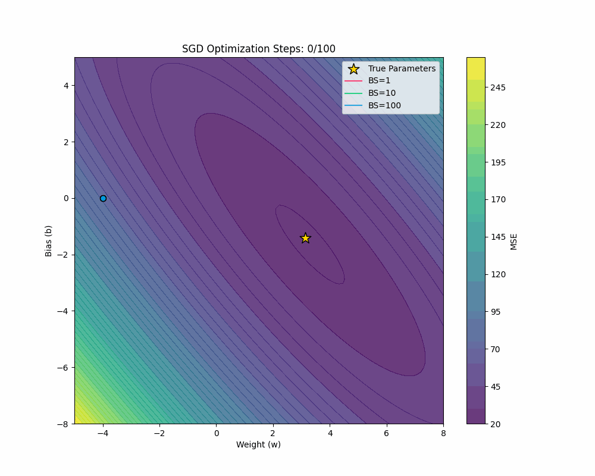
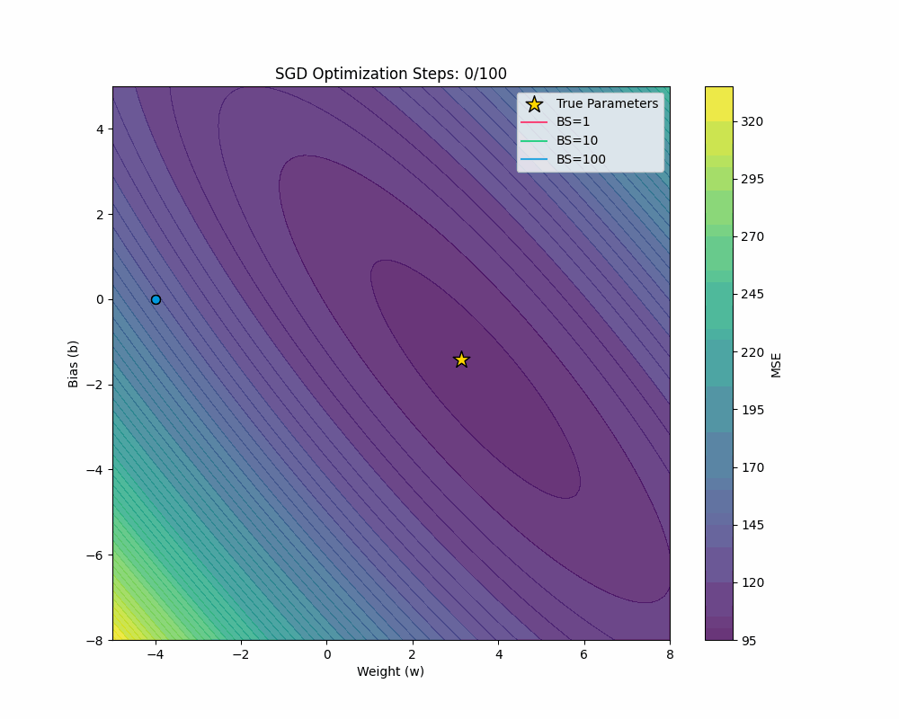
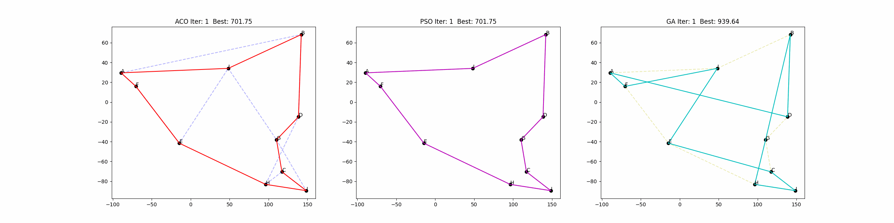
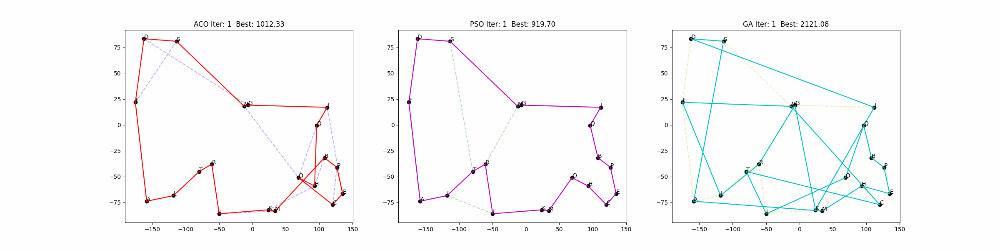
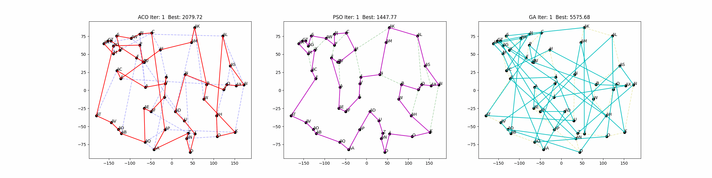

# Numerical Methods & Optimzation

  
  

(a) The impact of batch on the optimization process; (b) The performance of different gradient descent variants on the same task.

## # Numberical Methods 
- Solution of Equations   
    - Solution of Linear Equations System
        - Principle Component Method
        - Jacobi Iteration ALgorithm
        - Gauss-Seidel Iteration Algorithm  
    - Solution of Nolinear Equations
        - Bisection Method
        - Newton's Method
        - Secant Method   
- Interpolation
    - 1D Interpolation Methods. 
        - Lagrange interpolation
        - Newtonian interpolation
        - cubic spline interpolation     
        - Aitken interpolation  
        - Hermit interpolation  
    - 2D Interpolation Methods
        - Nearest Neighbor Interpolation
        - Bilinear Interpolation
        - Bicubic Interpolation
- Approximation
    - approximation of functions 
- Integration & Difference Equations
    - Numerical Intergration
        - Rectangular Method
        - Trapezoidal Rule
        - Simpson's Rule
        - Gaussian Quadrature
        - Monte Carlo
    - Numerical Ode
        - Eular Method
        - Improved Euler Method
        - Runge Kutta from 2~10

## # Optimisation Algorithms

- Gradient Descent
    - Batch
        - SGD
        - Batched
        - Mini-Batched
    - Variants
        - SGD
        - Momentum
        - Nesterov Accelerated Gradient (NAG)
        - AdaGrad
        - RMSProp
        - AdaDelta
        - Adam (Adaptive Moment Estimation) 
- Heuristic Methods
    - Traveling Salesman Problem
        - Genetic Algorithm 
        - Particle Swarm Optimization
        - Ant Colony Optimization
    - Constrained optimization problem (TODO)
        - Genetic Algorithm 
        - Particle Swarm Optimization
        - Ant Colony Optimization
        - Simulated Annealing 
    - MNIST
        - Multi-Layer Perceptron (see this [notebook](https://github.com/HugoPhi/jaxdls/blob/main/mlp_mnist.ipynb))
     
## # Some Interesting Animations 

### @ Batched SGDs on Linear Regression

  
  
  

SGD with <code>batch_size=1, 10, 100</code>, on Linear Regression Task with (a) <code>noise=0.5</code>; (b) <code>noise=5</code>; (c) <code>noise=50</code>.

### @ GD Varients on Different Regression Functions.

  
  

SGD, Momentum, NAG, AdaGrad, RMSProp, AdaDelta, Adam on Regression Fuction: (a) $f(x) = \sin(wx)+b$; (b) $f(x) = w\sin(wx)+b$. 

### @ Traveling Salesman Problem by Heuristic Methods

> 💡 Notice:  
> - ACO: Basic.    
> - PSO: 2-opt.   
> - GA : with 2-opt, elite, tournament, OX crossover.    

  

TSP with 10 cities. (a) ACO; (b) PSO; (c) GA.

  

TSP with 20 cities. (a) ACO; (b) PSO; (c) GA.

  

TSP with 50 cities. (a) ACO; (b) PSO; (c) GA.

  

TSP with 100 cities. (a) ACO; (b) PSO; (c) GA.

  

TSP with 200 cities. (a) ACO; (b) PSO; (c) GA.

